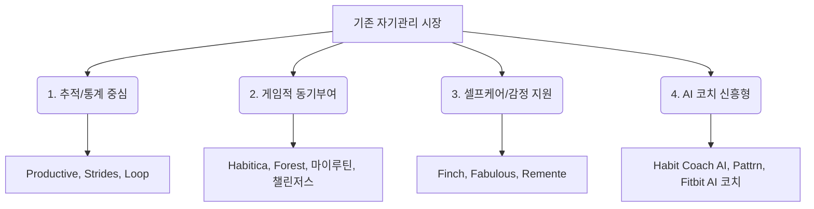
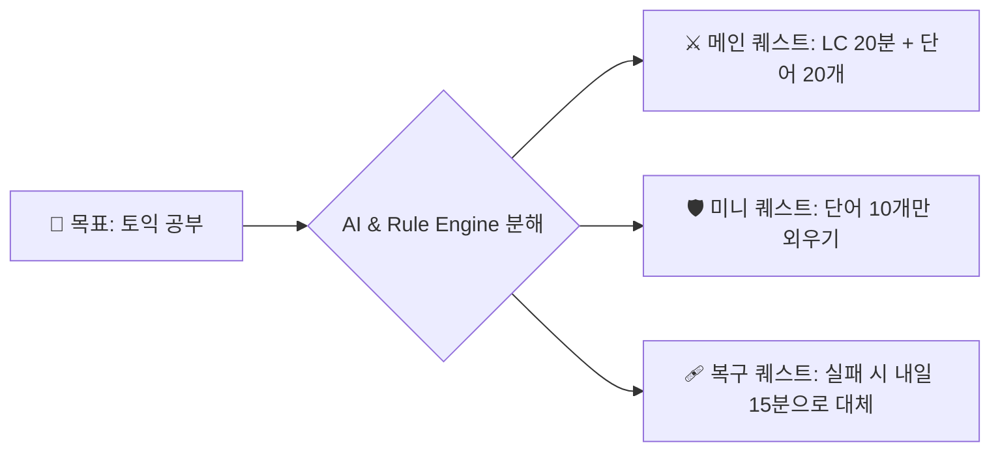

# 🎯 Questlog (퀘스트로그, 가칭)
> **"실행을 못 하는 사람을 위해, 목표를 더 작고 현실적인 퀘스트로 바꾸고, 실패 이후의 복구까지 설계한 AI 적응형 루틴 서비스"**

---

## 📌 1. 프로젝트 개요

| 항목 | 상세 내용 |
| :--- | :--- |
| **주제** | AI 코치가 있는 게이미피케이션 자기관리 앱 |
| **분야** | 생산성(Productivity) × 웰니스(Wellness) × AI 코칭 × 라이트 게임화(Gamification) |
| **서비스명** | **Questlog (퀘스트로그)** |
| **한 줄 정의** | 사용자의 목표를 하루 단위 퀘스트로 쪼개고, 실패 패턴·컨디션·일정 변화에 맞춰 AI가 다음 행동을 다시 설계해주는 루틴 앱 |
| **핵심 가치** | 기록이 아닌 **지속성**에 초점을 맞춘 회복 중심의 자기관리 |

### 🔍 기획 배경 (Why Questlog?)
1. **성장하는 습관 추적 및 웰니스 시장**
   - 글로벌 습관 추적 앱 시장 규모는 2025년 약 11억~19억 달러 수준으로 추정되며, 2030년대 초반까지 두 자릿수 연평균 성장률(CAGR)이 예상됩니다.
   - 디지털 헬스 코칭 시장(2024년 109.9억 달러 → 2030년 220.6억 달러) 및 국내 웰니스 앱 시장(2024년 1.569억 달러 → 2030년 3.863억 달러) 또한 가파른 성장세를 보이고 있습니다.
2. **밀레니얼·Z세대의 웰니스 일상화**
   - 일시적인 소비보다 매일 수행하는 개인화된 실천으로 웰니스를 인식하는 경향이 강해졌습니다.
3. **게임화(Gamification)의 효과 입증**
   - 학술 연구 및 체계적 문헌고찰에 따르면, 게임화 요소는 사용자의 지속적인 서비스 사용 및 동기부여에 긍정적 혹은 혼합적 효과를 반복적으로 보여주고 있습니다.

---

## 🎯 2. 프로젝트 한 줄 결론

> [!IMPORTANT]
> **"Questlog는 단순한 기록용 습관 앱이 아닙니다."**  
> 원대한 목표만 세우고 실천하지 못하는 이들을 위해, 목표를 가장 작고 실행 가능한 행동 단위로 쪼개고, 실패하더라도 자책감 없이 복귀할 수 있도록 AI가 자동으로 난이도를 하향 조정해주는 **'실행형·복구형·적응형 루틴 앱'**입니다.

---

## 📊 3. 기존 시장 분석 및 서비스 공백(Whitespace)

### 3-1. 시장 경쟁군 분류

1. **추적·통계 중심형**
   - **Productive / Strides / Loop Habit Tracker**
   - *특징:* 템플릿 제공, 대시보드 통계 및 리포트 시각화, 리마인더 중심.
   - *한계:* "무엇을 얼마나 기록했는지"에 집중하여, 실행력이 약한 유저에게는 단순히 실패의 기록만 누적되는 역효과가 있음.
2. **게임적 동기부여 중심형**
   - **Habitica / Forest / 마이루틴 / 챌린저스**
   - *특징:* RPG 요소를 도입한 캐릭터 성장(Habitica), 타이머를 통한 시각적 보상(Forest), 소셜 네트워킹 및 금전적 보상(챌린저스).
   - *한계:* 지나치게 무거운 RPG 시스템은 피로감을 주며, 금전적 보상 방식은 본질적인 습관 형성보다 보상 체계 자체에 의존하게 만듦.
3. **셀프케어·감정 지원형**
   - **Finch / Fabulous / Remente**
   - *특징:* 가상 펫 육성을 통한 정서적 안정(Finch), 행동과학 기반 루틴 코칭(Fabulous).
   - *한계:* 멘탈 케어에 치우쳐 있어 구체적인 일상 업무 및 학업 생산성 관리와의 연계가 다소 느슨함.
4. **AI 코치 신흥형**
   - **Habit Coach AI / Pattrn / Google Fitbit**
   - *특징:* 채팅이나 전화 형태의 AI 인터랙션, 실패 패턴 분석을 통한 일정 자동 조정.
   - *한계:* 텍스트 기반 대화 위주이거나 웨어러블 디바이스 의존도가 높아 가볍고 직관적인 앱 사용성이 아쉬움.

### 3-2. Questlog가 파고드는 시장의 공백 (Whitespace)

* **대상 유저:** 할 일은 많지만 쉽게 지치고, 하루라도 루틴을 놓치면 자책감에 앱 자체를 이탈해버리는 대학생, 취준생, 주니어 직장인.
* **해결책 (Whitespace):**
  1. 하루 계획을 실현 가능한 **최소 단위의 퀘스트**로 분해.
  2. 실패 다음 날 자동으로 난이도를 완화하여 **복구 루프** 형성.
  3. 무겁지 않은 **라이트 게임화** 요소 결합.
  4. **생산성**과 **셀프케어**를 하나의 라이프 플로우 안에서 제공.

---

## 💡 4. 서비스 컨셉 및 문제 정의

### 4-1. 목표의 퀘스트화 예시
추상적이고 거대한 목표를 시스템과 AI가 실행 가능한 단위로 재분배합니다.

* **목표:** "토익 점수 올리기" (6주 과정, 주 5회, 하루 40분 설정 시)

### 4-2. 문제 정의 및 가설
* **기존 습관 앱 이탈 원인:**
  - 초기 계획이 너무 과도함.
  - 하루의 실패가 전체 스트릭(Streak) 파괴로 이어져 중도 포기하게 만듦.
  - 리마인더만 울릴 뿐 정작 지금 당장 무엇을 해야 할지 막막함.
* **핵심 가설:**
  > "목표를 퀘스트 단위로 쪼개고, 실패 후 회복 루프를 제공하며, AI가 과장된 격려보다 실질적인 계획 재설계에 초점을 맞춘다면, 사용자는 기존 체크리스트 앱 대비 더 높은 잔존율(Retention)을 보이고 한층 더 주도적으로 움직일 것이다."

---

## 👥 5. 타깃 유저 정의

### 1차 타깃: 20~29세 대학생 / 취준생 / 주니어 직장인
* **특징:** 학업, 운동, 수면, 할 일 등 다방면의 관리를 원함. 노션이나 캘린더를 쓰지만 지속하지 못함. 루틴이 깨졌을 때 오는 좌절감으로 앱을 방치하는 경향이 있음.
* **니즈:** 무겁고 복잡한 도구 대신 가벼운 개인 맞춤형 실행 가이드를 원함.

### 2차 타깃: 집중력 관리와 생활 리듬 회복이 필요한 사용자
* **특징:** 하루 단위 실천이 쉽게 무너지지만, 아주 작게 시작하는 방식에는 긍정적으로 반응함.
* **니즈:** 정서적 공감도 좋지만, 핵심은 "오늘 당장 내 행동의 우선순위를 정리해 주는 경험"임.

---

## ⭐ 6. 핵심 차별점 (Key Differentiators)

1. **AI는 '응원봇'이 아닌 '실행 설계자'**
   - 감성적인 위로보다 **계획 재조정**에 집중합니다.
   - 역할 제한: ① 목표의 일일 퀘스트 분해, ② 실패 패턴 기반 난이도 제안, ③ 주간 회고 요약.
2. **실패 페널티 대신 복구(Recovery) 설계 중심**
   - 스트릭 유지보다 **복귀율**을 핵심 지표로 삼습니다.
   - 3일 연속 실패 시 퀘스트 난이도 자동 완화, 과부하 감지 시 휴식 퀘스트 제안, 복구 퀘스트를 통한 연속성 복구 지원.
3. **가벼운(Lite) 게임 시스템**
   - RPG 전투나 아이템 파밍 등의 복잡한 메타게임은 제외하고, 레벨/XP/배지/클래스(직업)/주간 도전/리커버리 토큰 등 본질적인 성장 동기부여 요소만 차용합니다.
4. **생산성과 셀프케어의 단일 플로우화**
   - 공부/업무 루틴과 수면/휴식 체크인이 단일 타임라인 안에서 자연스럽게 융합됩니다.
5. **라이트한 소셜 자극**
   - 과도한 소셜 압박이나 현금성 보상을 지양하고, 가볍게 서로 영감을 주고받는 듀오/주간 챌린지 형태로 구현합니다.

---

## 🛠️ 7. 핵심 기능 상세

### 7-1. AI 온보딩 (Onboarding)
* 가입 시 기본 질문(루틴 목표, 가용 시간, 컨디션 상태, 선호 성향 등)을 통해 유저의 **클래스**를 결정하고 첫 주 맞춤형 퀘스트 세트를 빌드합니다.
  - **Scholar (공부형):** 학업, 자격증, 연구 중심
  - **Builder (생활정리형):** 가사, 시간 관리, 환경 정돈 중심
  - **Runner (운동형):** 체력 관리, 식습관, 운동 중심
  - **Balance (균형형):** 고른 웰니스 및 생산성 배분

### 7-2. 오늘의 퀘스트 보드 (Home)
* 오늘의 메인 퀘스트 3개, 미니 퀘스트 2개, 컨디션 체크, XP/레벨 상태, AI 코치의 일일 한 줄 요약을 배치하여 **"이것만 끝내면 오늘 하루는 성공"**이라는 직관적인 안도감을 선사합니다.

### 7-3. AM / PM 체크인
* **AM 체크인:** 오늘 아침의 에너지 상태, 예상 바쁨 정도, 오늘 가장 중요한 단 1가지 목표 입력.
* **PM 체크인:** 실천 여부 체크, 미시행 시 구체적 원인(시간 부족/집중력 저하/감정 기복 등) 태깅, 내일 조정을 위한 피드백 제공.
* *이 체크인 데이터가 AI가 루틴을 재설계하는 핵심 원천 데이터가 됩니다.*

### 7-4. 적응형 AI 코치
* 단순 텍스트 위로가 아닌 구조적 피드백 제공.
  - *"어제는 40분 공부가 다소 부담스러웠던 것으로 보입니다. 오늘 퀘스트는 15분으로 낮춰 시작할게요."*
  - *"주로 밤 10시 이후 루틴 성공률이 낮습니다. 밤 루틴을 간소화하고 오전 시간대로 퀘스트를 재배치합니다."*

### 7-5. 라이트 게임 시스템
* 퀘스트 성공 및 체크인 완료 시 XP 획득, 레벨 업.
* **리커버리 토큰:** 실패한 스트릭을 단 1회 무료 복귀 시켜주거나 퀘스트 난이도를 낮출 때 소모할 수 있는 전용 재화.

### 7-6. 주간 리포트 (Weekly Report)
* 한 주간의 달성률, 최적의 활성화 시간대, 단골 실패 조건 분석, 다음 주 권장 난이도 및 구조 조정을 위한 AI 요약 제공.

---

## 📦 8. MVP 범위 (Scope)

### ✅ MVP 포함 항목 (In-Scope)
* 이메일/소셜 회원가입 및 로그인
* 핵심 목표 1개 생성 및 AI 온보딩 프로세스
* 오늘의 퀘스트 보드 (완료 체크 및 컨디션 입력)
* AM/PM 체크인 기능 (실패 태깅 포함)
* XP / 레벨 / 스트릭 시스템 및 리커버리 토큰 1종
* 한 주 마무리를 위한 주간 리포트
* 루틴 유지를 돕는 Expo 푸시 알림

### ❌ MVP 제외 항목 (Out-of-Scope)
* 친구 파티 / 길드 / 소셜 네트워크 기능
* 음성 AI 코칭 및 자유 대화형 챗봇
* 애플워치, 핏빗 등 웨어러블 디바이스 연동
* 캐시백이나 기프티콘 등 현금성 리워드 시스템
* 여러 개의 대형 목표 동시 운영
* 복잡한 대시보드 형태의 데스크톱 화면

---

## 🎨 9. 화면 구성 및 사용자 흐름

1. **온보딩 화면**
   - 목표 설정 → 생활 패턴 입력 → 클래스 선택 → 첫 주 퀘스트 자동 생성
2. **홈 / 오늘의 퀘스트 보드**
   - 당일 수행할 메인/미니 퀘스트 리스트, 완료 인터랙션, 에너지 상태바, AI 한 줄 코치 메시지
3. **체크인 화면**
   - 오전 컨디션 기록 / 오후 회고 및 실패 사유 태그 선택
4. **퀘스트 상세 / 편집 화면**
   - 퀘스트 빈도, 수행 시간대, 미니 퀘스트 행동 정의, 실패 시 복구 행동 설정
5. **주간 리포트 화면**
   - 주간 달성률 차트, 시간대 성공 패턴 분석, 다음 주 난이도 및 배치 제안 리포트
6. **프로필 / 성장 화면**
   - 클래스 정보, 획득 배지 목록, 누적 XP 및 현재 연속 달성일, 소유한 리커버리 토큰 현황

---

## 💻 10. 기술 스택 제안 (Tech Stack)

| 레이어 | 기술 | 선정 이유 |
| :--- | :--- | :--- |
| **Frontend** | **React Native + Expo (TypeScript)** | 크로스 플랫폼 빠른 개발 가능, 푸시 알림 인프라(Expo Notification) 구축 용이, 모바일 중심의 우수한 네이티브 사용성 제공 |
| **Backend** | **Supabase** | Auth, PostgreSQL Database, Edge Functions, Storage를 한 번에 해결하여 MVP 빌드 속도 극대화 |
| **AI Engine** | **LLM API + Structured Output (JSON)** | 온보딩 계획 수립, 주간 분석 요약, 텍스트 코칭 메시지 생성에 활용. (수치 계산 및 룰 처리는 룰 엔진에서 수행하여 안전성 확보) |
| **Analytics** | **PostHog / Amplitude** | 온보딩 전환율, 리텐션, 퀘스트 완료율, **실패 후 복귀율** 모니터링 |

---

## 🛡️ 11. AI 설계 및 안전 원칙
* **비치료적 접근 명시:** 정신질환 판단, 진단, 전문 상담 표현 절대 금지.
* **데이터 활용 통제:** 감정/상태 입력값은 오직 루틴 난이도 세부 조정에만 기계적으로 활용되며, AI 피드백에 감성적 분석을 덧붙이지 않음.
* **하이브리드 제어:** 보상 지급, 스트릭 계산, 리커버리 작동 등 결정적인 로직은 AI가 아닌 시스템 룰 엔진(Rule Engine)이 전담 처리.
* **사용자 통제권 보장:** 개인정보 수집 동의 철회 및 데이터 영구 삭제 기능 제공.

---

## 📈 12. 성공 지표 (KPI)

* **온보딩 완료율:** 가입부터 첫 주 퀘스트 생성 완료까지의 비율
* **D1 / D7 / D30 리텐션:** 지속적인 앱 재방문 지표
* **주간 체크인 완료율:** AM/PM 체크인의 꾸준한 참여도
* **⭐ 핵심 지표: 실패 후 48시간 내 복귀율**
  - 본 서비스의 본질은 "실패하지 않게 만드는 것"이 아닌, **"넘어져도 죄책감 없이 즉시 털고 일어나 돌아오게 만드는 회복탄력성"**에 있으므로, 복귀율을 최고 핵심 지표로 선정합니다.

---

## 📁 13. 포트폴리오 문서 구성안

1. **프로젝트 개요:** 프로젝트명, 기획 취지, 역할
2. **문제 정의:** 기존 습관 앱의 한계 분석 및 유저 Pain Point 정의
3. **시장 조사 & 공백 발견:** 경쟁사 비교 분석을 통한 Whitespace(복구형 루틴) 도출
4. **타깃 유저 & JTBD:** 페르소나 설계 및 핵심 Job-to-be-done 도출
5. **서비스 컨셉 & 가치 제안:** 복구 메커니즘 중심 가치 정의
6. **핵심 기능 설계:** 기능 상세 스펙 기술
7. **IA 및 사용자 흐름:** 정보 구조도 및 핵심 시나리오 플로우차트
8. **AI 아키텍처:** 프롬프트 엔지니어링, JSON Structured Output 설계, 안전 가이드라인
9. **MVP 스코프 관리:** 기획 우선순위(Must/Should/Could) 및 검증 가설
10. **화면 설계 & UX:** 주요 화면 와이어프레임 및 디자인 시스템 규칙
11. **데이터 스키마 및 KPI:** 이벤트 트래킹 설계 및 수집 정책
12. **회고:** 프로젝트 교훈, 한계점, 향후 확장 계획
